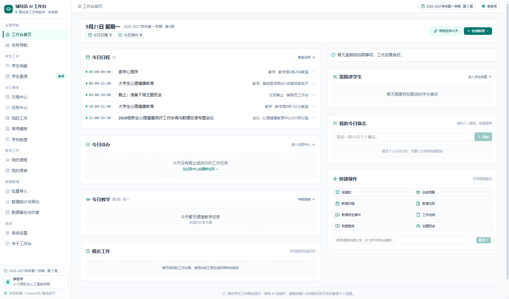

# 中南大学生工作台 · ZUEL Student Workstation

> 面向高校辅导员的**本机学生工作台**：把教务/学工系统导出的学生信息表 + 成绩单丢进来，
> 自动拼出每个人的画像、成绩、宿舍与学业预警。
>
> **数据只存本机，全程不联网、不上传服务器。**



## 📥 下载使用（不想看代码的直接看这里）

到 [Releases](https://github.com/xpsmsn/zuel-student-workstation/releases) 页面，
在 **v1.9** 的 Assets 里挑一个下载：

| Assets 文件名 | 对应安装包 | 适合谁 |
| --- | --- | --- |
| `ZUEL-StudentWorkstation-Portable-v1.9.exe` | 绿色版 | 复制到任意文件夹双击就跑，**不用安装** |
| `ZUEL-StudentWorkstation-Setup-v1.9.exe` | 安装程序 | 日常使用，装到开始菜单/桌面，**不需要管理员权限** |
| `ZUEL-StudentWorkstation-v1.9.msi` | 单位部署 | 学校统一部署（域策略下发），通常需管理员权限 |

三个文件里的程序完全一样，只是安装方式不同。
文件名是英文的，是因为 GitHub 的 Release 附件不支持中文名（会被清成 `-.exe`），
下载后建议改回中文名再分发。

**运行环境**：Windows 10/11 64 位 + Microsoft Edge WebView2 运行时
（Win11 与多数装过 Edge 的 Win10 已有，缺的安装器会自动引导安装）。
**不需要** Node.js / Rust / .NET —— 那些只在重新出包时才用得到。

详细操作见仓库内的 `中南大学生工作台-用户使用手册.docx`。

## ✨ 主要功能

- **导入**：学生信息表 + 成绩单，按列合并、按批次管理；支持三种导入模式（覆盖 / 追加 / 合并）
- **总览**：人数、覆盖班级、需重点关注、不及格、加权成绩、绩点等指标卡 + 手写 SVG 图表，点图可下钻
- **列表**：筛选（班级/性别/政治面貌/宿舍/自定义条件，可多选）、表头排序、列自定义、详情页全字段编辑
- **关注视图**：挂科、绩点偏低、未录成绩、已写备注等预设筛选
- **宿舍看板**：按床位基准生成房间卡，空位/满员/超员一目了然；**v1.9 起可导出 A4 横向「查寝打分表」**
- **取数指引 + 新手向导**：v1.9 重做为 6 步实操向导，每步都有可点的按钮，跟着做一遍就能完成下载与导入
- **备份恢复 / 导出 CSV / 导入历史**：随时回滚
- **桌面增强**：最小化到托盘后台常驻、可选开机自启、导出文件落「下载」文件夹并自动打开

## 🔒 数据在哪

桌面版数据存在 `%LOCALAPPDATA%\cn.edu.zuel.studentworkstation\...` 的 Local Storage 里
（存储键 `counselor_workstation_v2`）。卸载程序**不会**删数据（有意为之，防误删）。
换机或备份请走「导出 CSV / 备份文件」。

⚠️ 桌面版与用浏览器打开 `中南大学生工作台.html` 的数据是**两份、互不通用**。

## 🛠 开发者说明

仓库里的 `中南大学生工作台.html` 是**单文件原型**——没有构建步骤、没有框架，
整个产品逻辑都在这一份文件里。桌面版不改它一行，而是由
`.build/build-desktop.js` 同步成 `app/src/index.html`，并在 `</body>` 前注入一段
**桌面适配层**（只处理网页做不到的三件事：导出落盘、外链用系统浏览器打开、关掉浏览器右键菜单）。
适配层只在能拿到 `window.__TAURI__` 时才生效。

```bash
# 1) 生成桌面版入口（仓库不含构建产物，必须先跑）
node .build/build-desktop.js

# 2) 出包
cd app && npm install && npx tauri build
```

回归测试（Node + vm 沙箱跑原型里的真实函数）：

```bash
node .build/check-syntax.js 中南大学生工作台.html
node .build/test-library.js          # 128 条断言
node .build/test-delete-backup.js
node .build/test-desktop.js app/src/index.html   # 28 条，注意要传桌面版入口
```

**目录**

| 路径 | 说明 |
| --- | --- |
| `中南大学生工作台.html` | 产品本体（单文件原型） |
| `中南大学生工作台_方案说明.md` | 需求确认与实现方案（含数据字典、导入合并策略） |
| `中南大学生工作台-用户使用手册.docx` | 给辅导员看的使用手册 |
| `app/` | Tauri 2 桌面工程（Rust 壳 + 打包配置） |
| `.build/` | 构建与回归测试脚本 |
| `素材截图/` | 各页面截图 |
| `发布/` | 安装说明（exe/msi 本体已 gitignore） |

## 📄 License

本项目为中南大学辅导员自用工具，源码开放供参考与二次开发。
产品名、校名与相关标识归各自权利人所有。
